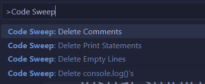

# CODE SWEEP

## Description
This is a simple VS-Code extension that allows users to quickly DELETE comments,  empty lines,  print statements,  and console logs of a selected area or entire file.

## How to Use 
0. Highlight text in  a file to preform only on the selected text or do nothing and have it preform on the whole file. 

1. Open Command Pallet: (ctl + shift + p)

2. Type in Code Sweep and select the command you want to happen

3. Watch it preform thse action!

## Supported Languages
#### Comments 
      Javascript, Java, Python, C++, C, C#, Swift, Php, Rust, Go, Lua, Dart, Kotlin, Typescript,  Scala, Css, Html, Xml, Xhtml, Xslt
#### Empty Lines
      All languages
#### Print Statements
      Java and Python
#### Console Logs
      JavaScript and TypeScript